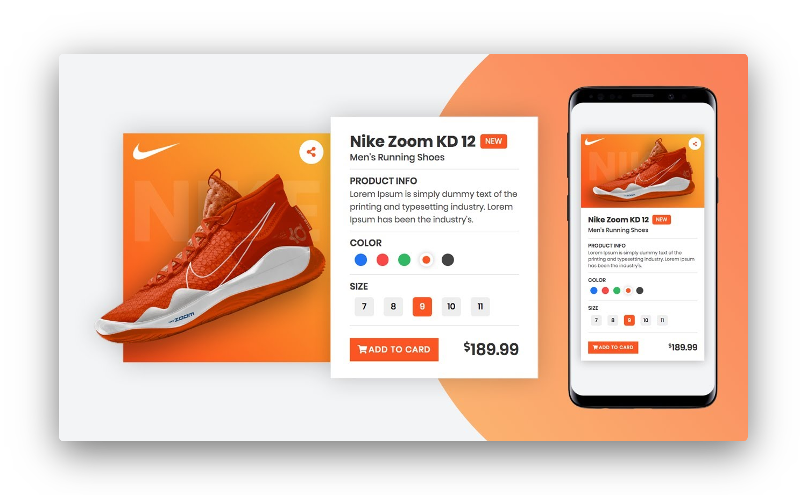

  
  
  
  
  
  

<h4 align="center">
  
</h4>

 

### :rocket: Tecnologias usadas
Esse projeto foi desenvolvido com as seguintes tecnologias:
- HTML
- CSS
- Javascript

### 💻 Demo Web

[Visitar](https://www.ialexanderbrito.com.br/product)

### 💻 Projeto

Card responsivo feito em HTML, Css e Javascript.

### :recycle: Como contribuir

- Fork esse repositório;
- Crie uma branch com a sua feature: `git checkout -b my-feature`
- Commit suas mudanças: `git commit -m 'feat: My new feature'`
- Push a sua branch: `git push origin my-feature`

Depois que o merge da sua pull request for feito, você pode deletar a sua branch.

### :memo: Licença

Esse projeto está sob a licença MIT. Veja o arquivo [LICENSE](LICENSE) para mais detalhes.

### 📱 Social

Me acompanhe nas minhas redes sociais.

    
    
  
  
   
  
   

   
  
   
  
  

---

Feito com ❤️ by **Alexander** 🤙🏾
